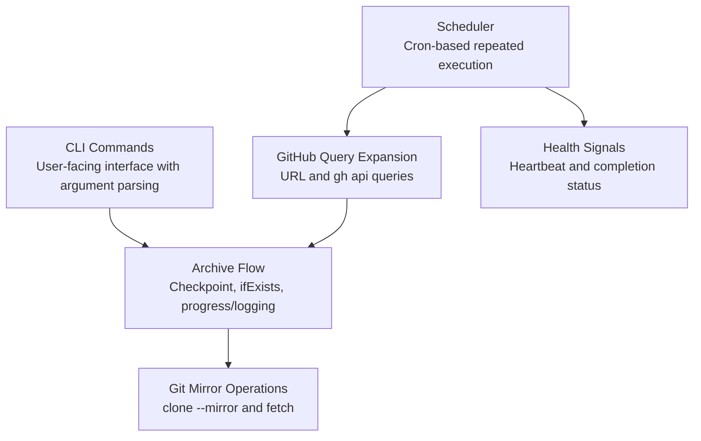
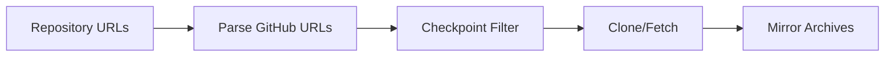
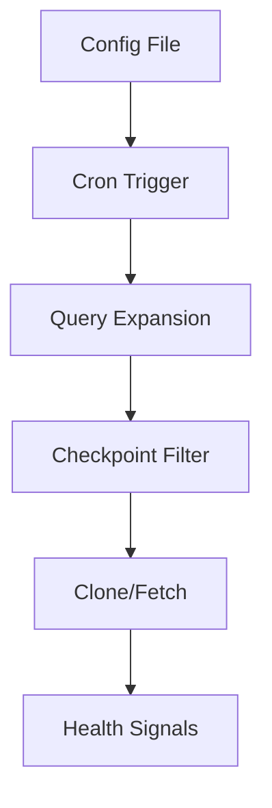

# Architecture Overview

This document describes the high-level architecture and design principles of this CLI archiver application.

## Core Design Principles

### 1. Separation of Concerns

The codebase is organized into distinct layers with clear responsibilities:

- **Command Layer**: CLI interface, scheduler loop, and user interaction
- **Archive Flow Layer**: Repository query expansion, checkpoint filtering, and archive execution
- **Command Adapter Layer**: Git and GitHub CLI process execution
- **Utility Layer**: Reusable helpers for retry, logging, progress, config, and file output

### 2. Type Safety

- Runtime validation using Zod
- Strict TypeScript configuration for compile-time safety
- Project-specific error types for validation and repository failures

### 3. Resilience

- Exponential backoff for transient Git/GitHub CLI failures
- Internal concurrency limiting for repository work
- Optional checkpoint files for resumable batch execution

## System Architecture

## Key Components

### Command Execution Flow

1. **Input Parsing**: CLI URLs or scheduled query definitions
2. **Query Expansion**: Direct URLs and GitHub API query results become repository targets
3. **Checkpoint Filtering**: Completed `owner/repo` entries are skipped when configured
4. **Archive Coordination**: Repositories are processed with an internal concurrency limit
5. **Mirror Operation**: Clone missing archives or apply `ifExists` behavior to existing paths

### Existing Archive Handling

- `fetch`: Update an existing mirror clone
- `skip`: Keep the existing archive untouched
- `overwrite`: Remove and clone the archive again
- `error`: Fail the repository when the output path already exists

## Data Flow

### One-time Execution Mode

### Scheduled Execution Mode

## Error Handling Strategy

- Validation errors are wrapped in `GitHubArchiverZodParseError`.
- CLI execution collects repository failures and reports them together.
- Scheduled execution logs per-repository failures and continues through the remaining repositories.

## Testing Strategy

### Unit Tests

- Pure utilities and small behavior helpers
- Retry/backoff behavior
- Checkpoint and file output helpers
- URL parsing and placeholder replacement

### Integration Tests

- CLI command execution
- Scheduler `--runOnce` flow
- Existing archive behavior
- Local/fake Git execution without network dependency
